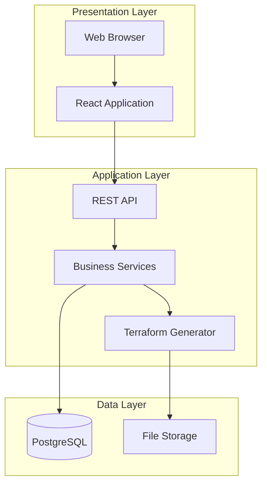
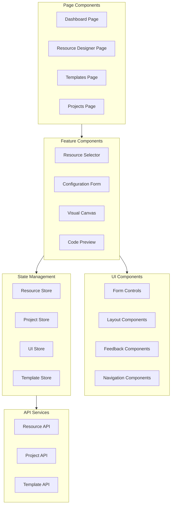
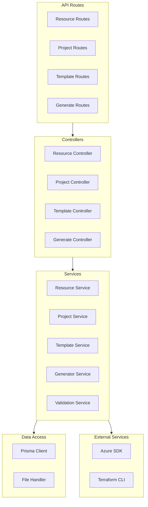
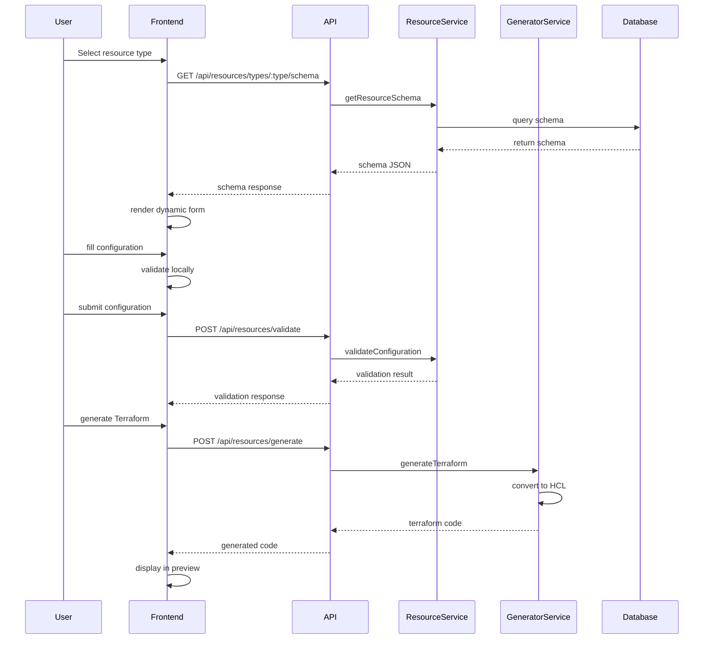
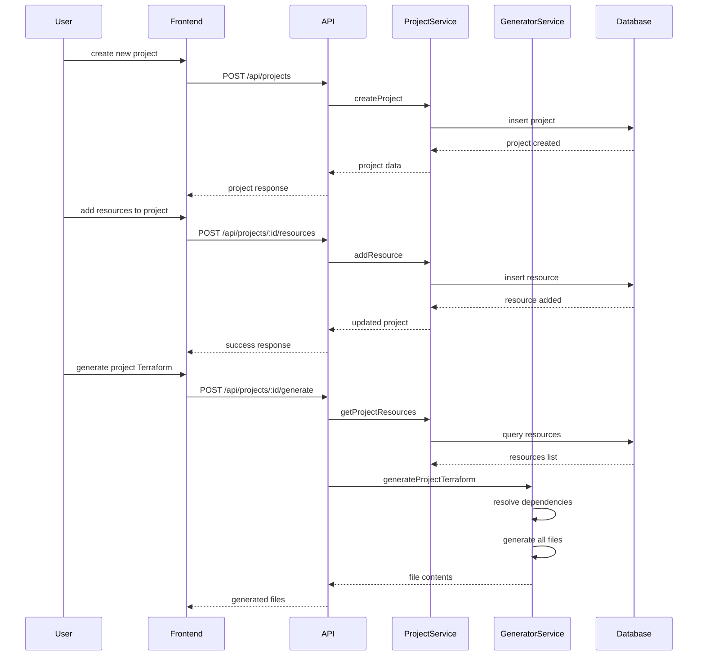
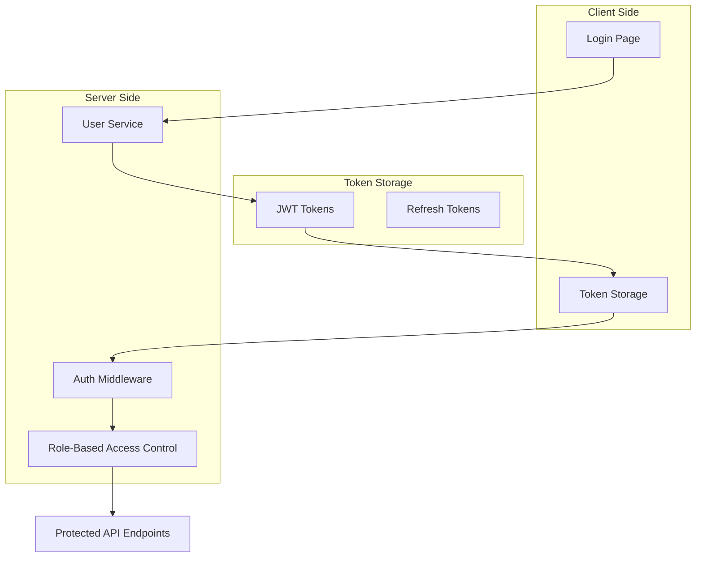
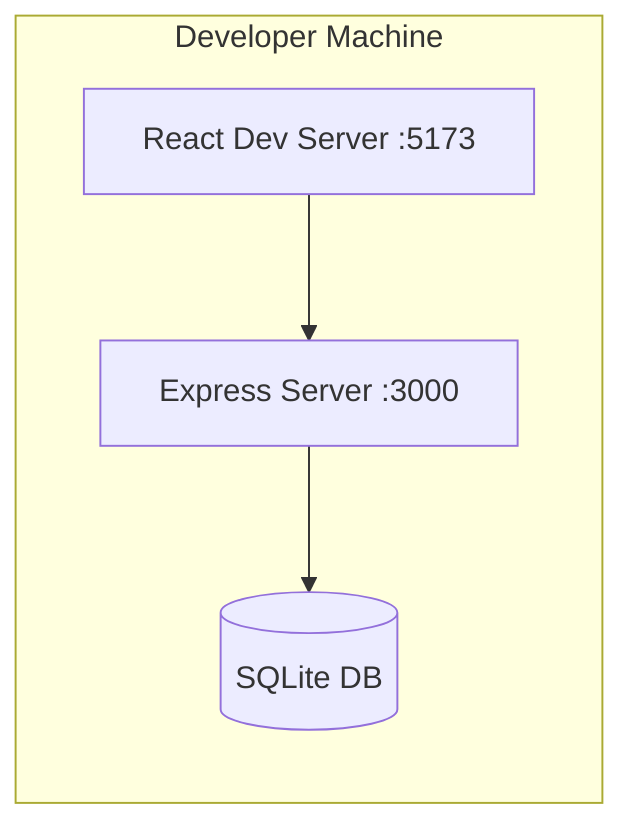
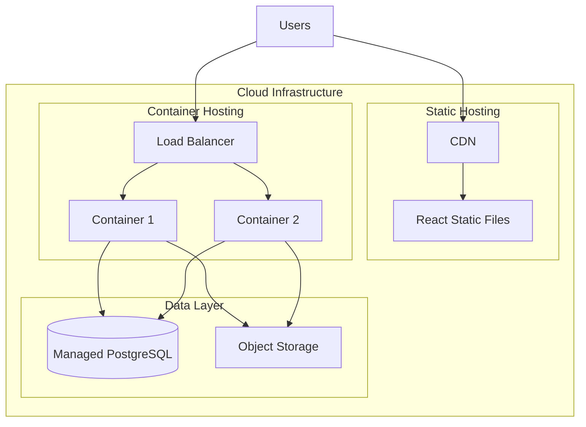
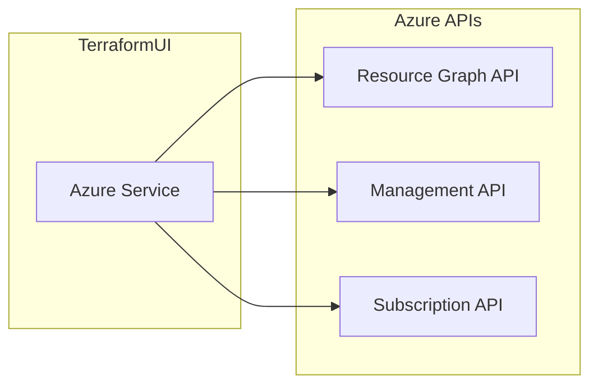
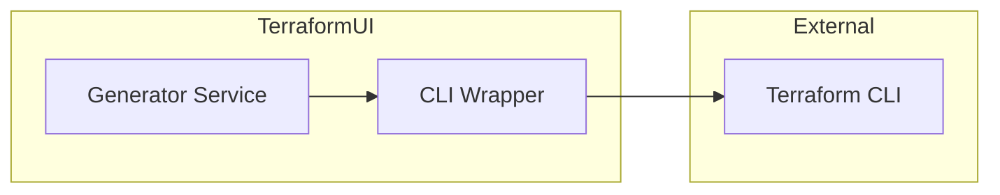

# TerraformUI - System Architecture

## High-Level Architecture

TerraformUI follows a modern three-tier architecture with clear separation of concerns:

---

## Component Architecture

### Frontend Architecture

### Backend Architecture

---

## Data Flow Architecture

### Resource Configuration Flow

### Project Management Flow

---

## Security Architecture

### Authentication and Authorization

### Security Considerations

| Layer | Security Measure |
|-------|-----------------|
| **Transport** | HTTPS/TLS for all communications |
| **Authentication** | JWT-based authentication with refresh tokens |
| **Authorization** | Role-based access control - RBAC |
| **Input Validation** | Zod schema validation on all inputs |
| **Output Encoding** | Sanitize all user-generated content |
| **Database** | Parameterized queries via Prisma |
| **Secrets** | Environment variables, never in code |

---

## Deployment Architecture

### Development Environment

### Production Environment

---

## Scalability Considerations

### Horizontal Scaling

- **Stateless API**: Backend services are stateless, allowing horizontal scaling
- **Load Balancing**: Distribute requests across multiple instances
- **Database Connection Pooling**: Efficient database connection management
- **Caching**: Redis for session storage and frequently accessed data

### Performance Optimization

| Area | Strategy |
|------|----------|
| **Frontend** | Code splitting, lazy loading, memoization |
| **API** | Response caching, pagination, query optimization |
| **Database** | Indexing, connection pooling, read replicas |
| **Generation** | Async processing, worker queues for large projects |

---

## Technology Decisions Record

### Decision 1: React over Angular/Vue

**Context**: Need a component-based UI framework for complex forms and visual canvas.

**Decision**: React with TypeScript

**Rationale**:
- Larger ecosystem and community support
- Better TypeScript integration
- More flexible for custom UI needs
- React Flow for visual canvas is React-specific

### Decision 2: Node.js over Python/.NET

**Context**: Need backend API with good performance and developer experience.

**Decision**: Node.js with Express and TypeScript

**Rationale**:
- Language consistency with frontend
- Excellent async I/O for API handling
- Large npm ecosystem
- Easy JSON manipulation for Terraform generation

### Decision 3: Prisma over TypeORM/Sequelize

**Context**: Need type-safe database access with migrations.

**Decision**: Prisma ORM

**Rationale**:
- Best-in-class TypeScript support
- Intuitive schema definition
- Automatic type generation
- Excellent migration system

### Decision 4: Ant Design over Material-UI

**Context**: Need enterprise-grade UI components similar to Azure Portal.

**Decision**: Ant Design 5.x

**Rationale**:
- Enterprise-focused component library
- Similar aesthetic to Azure Portal
- Comprehensive form components
- Built-in localization support

---

## Integration Points

### Azure API Integration

### Terraform CLI Integration - Optional

---

*Document Version: 1.0*
*Last Updated: 2026-02-21*
