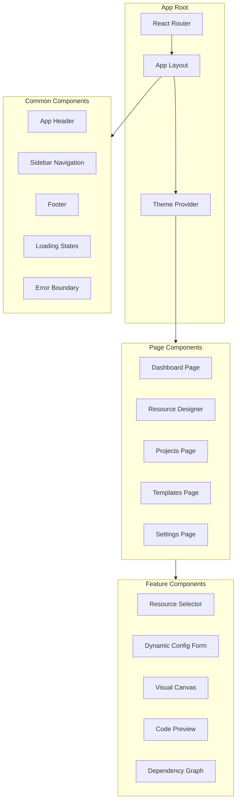

# TerraformUI - Frontend Component Hierarchy

## Overview

The frontend is built with React 18+ and TypeScript, using Ant Design for UI components. This document outlines the component structure and hierarchy.

---

## Component Architecture



---

## Directory Structure

```
frontend/src/
├── components/
│   ├── common/                    # Reusable UI components
│   │   ├── Button/
│   │   │   ├── Button.tsx
│   │   │   ├── Button.styles.ts
│   │   │   ├── Button.test.tsx
│   │   │   └── index.ts
│   │   ├── Input/
│   │   ├── Select/
│   │   ├── Modal/
│   │   ├── Card/
│   │   ├── Table/
│   │   ├── Tooltip/
│   │   ├── Loading/
│   │   └── ErrorBoundary/
│   │
│   ├── layout/                    # Layout components
│   │   ├── AppLayout/
│   │   │   ├── AppLayout.tsx
│   │   │   ├── AppLayout.styles.ts
│   │   │   └── index.ts
│   │   ├── Header/
│   │   ├── Sidebar/
│   │   ├── Breadcrumb/
│   │   └── Footer/
│   │
│   ├── forms/                     # Form components
│   │   ├── DynamicForm/
│   │   │   ├── DynamicForm.tsx
│   │   │   ├── FormField.tsx
│   │   │   ├── FormFieldArray.tsx
│   │   │   ├── FormFieldObject.tsx
│   │   │   ├── FormFieldMap.tsx
│   │   │   ├── useFormValidation.ts
│   │   │   └── index.ts
│   │   ├── ResourceForm/
│   │   └── VariableForm/
│   │
│   ├── canvas/                    # Visual canvas components
│   │   ├── ResourceCanvas/
│   │   │   ├── ResourceCanvas.tsx
│   │   │   ├── CanvasNode.tsx
│   │   │   ├── CanvasEdge.tsx
│   │   │   ├── CanvasControls.tsx
│   │   │   └── index.ts
│   │   ├── NodePalette/
│   │   └── ConnectionModal/
│   │
│   ├── code/                      # Code preview components
│   │   ├── CodeEditor/
│   │   │   ├── CodeEditor.tsx
│   │   │   ├── CodeEditor.styles.ts
│   │   │   └── index.ts
│   │   ├── FileTabs/
│   │   ├── FileTree/
│   │   └── DownloadButton/
│   │
│   └── resources/                 # Resource-specific components
│       ├── ResourceCard/
│       ├── ResourceList/
│       ├── ResourceIcon/
│       └── ResourceDetails/
│
├── pages/                         # Page components
│   ├── Dashboard/
│   │   ├── Dashboard.tsx
│   │   ├── Dashboard.styles.ts
│   │   ├── RecentProjects.tsx
│   │   ├── QuickActions.tsx
│   │   └── index.ts
│   │
│   ├── ResourceDesigner/
│   │   ├── ResourceDesigner.tsx
│   │   ├── DesignerSidebar.tsx
│   │   ├── DesignerCanvas.tsx
│   │   ├── DesignerForm.tsx
│   │   ├── DesignerPreview.tsx
│   │   └── index.ts
│   │
│   ├── Projects/
│   │   ├── Projects.tsx
│   │   ├── ProjectList.tsx
│   │   ├── ProjectCard.tsx
│   │   ├── CreateProjectModal.tsx
│   │   └── index.ts
│   │
│   ├── ProjectDetail/
│   │   ├── ProjectDetail.tsx
│   │   ├── ProjectHeader.tsx
│   │   ├── ProjectResources.tsx
│   │   ├── ProjectVariables.tsx
│   │   ├── ProjectOutputs.tsx
│   │   └── index.ts
│   │
│   ├── Templates/
│   │   ├── Templates.tsx
│   │   ├── TemplateList.tsx
│   │   ├── TemplateCard.tsx
│   │   ├── TemplatePreview.tsx
│   │   └── index.ts
│   │
│   └── Settings/
│       ├── Settings.tsx
│       ├── GeneralSettings.tsx
│       ├── AppearanceSettings.tsx
│       └── index.ts
│
├── stores/                        # Zustand stores
│   ├── useResourceStore.ts
│   ├── useProjectStore.ts
│   ├── useTemplateStore.ts
│   ├── useUIStore.ts
│   └── index.ts
│
├── services/                      # API services
│   ├── api.ts
│   ├── resourceService.ts
│   ├── projectService.ts
│   ├── templateService.ts
│   └── index.ts
│
├── hooks/                         # Custom hooks
│   ├── useResources.ts
│   ├── useProjects.ts
│   ├── useTemplates.ts
│   ├── useCodeGeneration.ts
│   ├── useDebounce.ts
│   └── index.ts
│
├── utils/                         # Utility functions
│   ├── formatters.ts
│   ├── validators.ts
│   ├── constants.ts
│   └── helpers.ts
│
├── types/                         # TypeScript types
│   ├── resource.ts
│   ├── project.ts
│   ├── template.ts
│   ├── api.ts
│   └── index.ts
│
├── styles/                        # Global styles
│   ├── theme.ts
│   ├── global.css
│   └── variables.css
│
├── App.tsx
├── main.tsx
└── routes.tsx
```

---

## Core Components

### 1. App Layout

```tsx
// components/layout/AppLayout/AppLayout.tsx

interface AppLayoutProps {
  children: React.ReactNode;
}

export const AppLayout: React.FC<AppLayoutProps> = ({ children }) => {
  return (
    <Layout className="app-layout">
      <AppHeader />
      <Layout>
        <AppSidebar />
        <Layout.Content className="app-content">
          {children}
        </Layout.Content>
      </Layout>
    </Layout>
  );
};
```

### 2. Dynamic Form Engine

The dynamic form engine is the heart of the resource configuration UI.

```tsx
// components/forms/DynamicForm/DynamicForm.tsx

interface DynamicFormProps {
  schema: PropertyDefinition[];
  values: Record<string, any>;
  onChange: (values: Record<string, any>) => void;
  errors?: ValidationErrors;
  disabled?: boolean;
}

export const DynamicForm: React.FC<DynamicFormProps> = ({
  schema,
  values,
  onChange,
  errors,
  disabled
}) => {
  const sortedSchema = useMemo(() => 
    sortByOrderAndGroup(schema), [schema]
  );
  
  return (
    <Form layout="vertical">
      {sortedSchema.map(property => (
        <FormField
          key={property.name}
          property={property}
          value={values[property.name]}
          onChange={(value) => handleFieldChange(property.name, value)}
          error={errors?.[property.name]}
          disabled={disabled}
        />
      ))}
    </Form>
  );
};
```

```tsx
// components/forms/DynamicForm/FormField.tsx

interface FormFieldProps {
  property: PropertyDefinition;
  value: any;
  onChange: (value: any) => void;
  error?: string;
  disabled?: boolean;
}

export const FormField: React.FC<FormFieldProps> = ({
  property,
  value,
  onChange,
  error,
  disabled
}) => {
  // Render different input types based on property.type
  const renderField = () => {
    switch (property.type) {
      case 'string':
        return property.enum ? (
          <SelectField property={property} value={value} onChange={onChange} />
        ) : (
          <InputField property={property} value={value} onChange={onChange} />
        );
      case 'number':
        return <NumberField property={property} value={value} onChange={onChange} />;
      case 'boolean':
        return <SwitchField property={property} value={value} onChange={onChange} />;
      case 'array':
        return <FormFieldArray property={property} value={value} onChange={onChange} />;
      case 'object':
        return <FormFieldObject property={property} value={value} onChange={onChange} />;
      case 'map':
        return <FormFieldMap property={property} value={value} onChange={onChange} />;
      default:
        return null;
    }
  };
  
  return (
    <Form.Item
      label={property.displayName}
      required={property.required}
      help={error || property.description}
      validateStatus={error ? 'error' : undefined}
      className={`form-field form-field--${property.ui?.width || 'full'}`}
    >
      {renderField()}
    </Form.Item>
  );
};
```

### 3. Resource Canvas

Visual canvas for designing infrastructure.

```tsx
// components/canvas/ResourceCanvas/ResourceCanvas.tsx

interface ResourceCanvasProps {
  resources: CanvasResource[];
  connections: Connection[];
  onResourceAdd: (resource: CanvasResource) => void;
  onResourceMove: (id: string, position: Position) => void;
  onConnect: (source: string, target: string) => void;
  onSelect: (resource: CanvasResource | null) => void;
}

export const ResourceCanvas: React.FC<ResourceCanvasProps> = ({
  resources,
  connections,
  onResourceAdd,
  onResourceMove,
  onConnect,
  onSelect
}) => {
  const nodes = useMemo(() => 
    resources.map(r => ({
      id: r.id,
      type: 'resourceNode',
      data: r,
      position: r.position
    })), [resources]
  );
  
  const edges = useMemo(() =>
    connections.map(c => ({
      id: `${c.source}-${c.target}`,
      source: c.source,
      target: c.target,
      animated: true
    })), [connections]
  );
  
  return (
    <ReactFlow
      nodes={nodes}
      edges={edges}
      onNodesChange={handleNodesChange}
      onEdgesChange={handleEdgesChange}
      onConnect={handleConnect}
      nodeTypes={nodeTypes}
    >
      <Controls />
      <MiniMap />
      <Background />
    </ReactFlow>
  );
};
```

### 4. Code Preview

Monaco editor-based code preview.

```tsx
// components/code/CodeEditor/CodeEditor.tsx

interface CodeEditorProps {
  files: Record<string, string>;
  activeFile: string;
  onFileSelect: (filename: string) => void;
  onDownload: () => void;
}

export const CodeEditor: React.FC<CodeEditorProps> = ({
  files,
  activeFile,
  onFileSelect,
  onDownload
}) => {
  return (
    <div className="code-editor-container">
      <FileTabs
        files={Object.keys(files)}
        activeFile={activeFile}
        onSelect={onFileSelect}
      />
      <div className="code-editor-content">
        <MonacoEditor
          language="hcl"
          value={files[activeFile] || ''}
          options={{
            readOnly: true,
            minimap: { enabled: false },
            fontSize: 14,
            theme: 'vs-dark'
          }}
        />
      </div>
      <div className="code-editor-actions">
        <Button icon={<CopyOutlined />} onClick={handleCopy}>
          Copy
        </Button>
        <Button type="primary" icon={<DownloadOutlined />} onClick={onDownload}>
          Download ZIP
        </Button>
      </div>
    </div>
  );
};
```

---

## Page Components

### 1. Dashboard Page

```tsx
// pages/Dashboard/Dashboard.tsx

export const Dashboard: React.FC = () => {
  const { projects, loading } = useProjects();
  const { templates } = useTemplates();
  
  return (
    <div className="dashboard">
      <PageHeader title="Dashboard" subtitle="Welcome to TerraformUI" />
      
      <Row gutter={[24, 24]}>
        <Col xs={24} lg={16}>
          <Card title="Recent Projects">
            <RecentProjects projects={projects.slice(0, 5)} />
          </Card>
        </Col>
        
        <Col xs={24} lg={8}>
          <Card title="Quick Actions">
            <QuickActions />
          </Card>
          
          <Card title="Featured Templates" style={{ marginTop: 24 }}>
            <TemplateList templates={templates.slice(0, 3)} compact />
          </Card>
        </Col>
      </Row>
    </div>
  );
};
```

### 2. Resource Designer Page

```tsx
// pages/ResourceDesigner/ResourceDesigner.tsx

export const ResourceDesigner: React.FC = () => {
  const [selectedResource, setSelectedResource] = useState<CanvasResource | null>(null);
  const { resources, addResource, updateResource, removeResource } = useResourceStore();
  const { generateCode, generatedFiles } = useCodeGeneration();
  
  return (
    <div className="resource-designer">
      <DesignerSidebar
        onResourceSelect={(type) => addResource(type)}
      />
      
      <div className="designer-main">
        <DesignerCanvas
          resources={resources}
          onSelect={setSelectedResource}
        />
      </div>
      
      <div className="designer-right">
        <Tabs defaultActiveKey="config">
          <TabPane tab="Configuration" key="config">
            {selectedResource ? (
              <ResourceConfigForm
                resource={selectedResource}
                onChange={(config) => updateResource(selectedResource.id, config)}
              />
            ) : (
              <Empty description="Select a resource to configure" />
            )}
          </TabPane>
          <TabPane tab="Code Preview" key="code">
            <CodePreview files={generatedFiles} />
          </TabPane>
        </Tabs>
      </div>
    </div>
  );
};
```

### 3. Projects Page

```tsx
// pages/Projects/Projects.tsx

export const Projects: React.FC = () => {
  const { projects, loading, createProject, deleteProject } = useProjects();
  const [createModalOpen, setCreateModalOpen] = useState(false);
  
  return (
    <div className="projects-page">
      <PageHeader
        title="Projects"
        subtitle="Manage your infrastructure projects"
        extra={[
          <Button
            key="create"
            type="primary"
            icon={<PlusOutlined />}
            onClick={() => setCreateModalOpen(true)}
          >
            New Project
          </Button>
        ]}
      />
      
      <ProjectList
        projects={projects}
        loading={loading}
        onDelete={deleteProject}
      />
      
      <CreateProjectModal
        open={createModalOpen}
        onClose={() => setCreateModalOpen(false)}
        onSubmit={createProject}
      />
    </div>
  );
};
```

---

## State Management

### Resource Store

```tsx
// stores/useResourceStore.ts

interface ResourceState {
  resources: CanvasResource[];
  selectedResourceId: string | null;
  
  // Actions
  addResource: (type: string, position?: Position) => void;
  updateResource: (id: string, updates: Partial<CanvasResource>) => void;
  removeResource: (id: string) => void;
  selectResource: (id: string | null) => void;
  moveResource: (id: string, position: Position) => void;
  connectResources: (sourceId: string, targetId: string) => void;
  
  // Computed
  getSelectedResource: () => CanvasResource | undefined;
  getResourceDependencies: (id: string) => CanvasResource[];
}

export const useResourceStore = create<ResourceState>((set, get) => ({
  resources: [],
  selectedResourceId: null,
  
  addResource: (type, position) => set(state => ({
    resources: [
      ...state.resources,
      {
        id: generateId(),
        type,
        name: `${type}_${state.resources.length + 1}`,
        configuration: {},
        position: position || { x: 100, y: 100 },
        dependencies: []
      }
    ]
  })),
  
  updateResource: (id, updates) => set(state => ({
    resources: state.resources.map(r =>
      r.id === id ? { ...r, ...updates } : r
    )
  })),
  
  removeResource: (id) => set(state => ({
    resources: state.resources.filter(r => r.id !== id)
  })),
  
  selectResource: (id) => set({ selectedResourceId: id }),
  
  // ... other actions
}));
```

### Project Store

```tsx
// stores/useProjectStore.ts

interface ProjectState {
  currentProject: Project | null;
  projects: Project[];
  loading: boolean;
  
  // Actions
  loadProjects: () => Promise<void>;
  loadProject: (id: string) => Promise<void>;
  createProject: (data: CreateProjectInput) => Promise<Project>;
  updateProject: (id: string, data: UpdateProjectInput) => Promise<void>;
  deleteProject: (id: string) => Promise<void>;
  
  // Resource management
  addResourceToProject: (resource: ResourceInput) => Promise<void>;
  updateResourceInProject: (resourceId: string, updates: Partial<ResourceInput>) => Promise<void>;
  removeResourceFromProject: (resourceId: string) => Promise<void>;
  
  // Generation
  generateTerraform: () => Promise<GeneratedFiles>;
  exportProject: (format: 'zip' | 'json') => Promise<Blob>;
}

export const useProjectStore = create<ProjectState>((set, get) => ({
  currentProject: null,
  projects: [],
  loading: false,
  
  // ... implementation
}));
```

---

## Custom Hooks

### useCodeGeneration

```tsx
// hooks/useCodeGeneration.ts

interface UseCodeGenerationReturn {
  generatedFiles: Record<string, string>;
  isGenerating: boolean;
  error: Error | null;
  generate: (projectId: string) => Promise<void>;
  generatePreview: (resources: Resource[]) => Promise<void>;
}

export const useCodeGeneration = (): UseCodeGenerationReturn => {
  const [generatedFiles, setGeneratedFiles] = useState<Record<string, string>>({});
  const [isGenerating, setIsGenerating] = useState(false);
  const [error, setError] = useState<Error | null>(null);
  
  const generate = async (projectId: string) => {
    setIsGenerating(true);
    setError(null);
    
    try {
      const response = await projectService.generateTerraform(projectId);
      setGeneratedFiles(response.files);
    } catch (err) {
      setError(err as Error);
    } finally {
      setIsGenerating(false);
    }
  };
  
  const generatePreview = async (resources: Resource[]) => {
    setIsGenerating(true);
    setError(null);
    
    try {
      const response = await resourceService.generatePreview(resources);
      setGeneratedFiles(response.files);
    } catch (err) {
      setError(err as Error);
    } finally {
      setIsGenerating(false);
    }
  };
  
  return {
    generatedFiles,
    isGenerating,
    error,
    generate,
    generatePreview
  };
};
```

### useResources

```tsx
// hooks/useResources.ts

interface UseResourcesReturn {
  resourceTypes: ResourceTypeSummary[];
  schemas: Map<string, AzureResourceSchema>;
  loading: boolean;
  error: Error | null;
  getSchema: (type: string) => Promise<AzureResourceSchema>;
  validateConfiguration: (type: string, config: Record<string, any>) => Promise<ValidationResult>;
}

export const useResources = (): UseResourcesReturn => {
  const [resourceTypes, setResourceTypes] = useState<ResourceTypeSummary[]>([]);
  const [schemas, setSchemas] = useState<Map<string, AzureResourceSchema>>(new Map());
  const [loading, setLoading] = useState(true);
  const [error, setError] = useState<Error | null>(null);
  
  useEffect(() => {
    loadResourceTypes();
  }, []);
  
  const loadResourceTypes = async () => {
    try {
      const types = await resourceService.getResourceTypes();
      setResourceTypes(types);
    } catch (err) {
      setError(err as Error);
    } finally {
      setLoading(false);
    }
  };
  
  const getSchema = async (type: string) => {
    if (schemas.has(type)) {
      return schemas.get(type)!;
    }
    
    const schema = await resourceService.getResourceSchema(type);
    setSchemas(prev => new Map(prev).set(type, schema));
    return schema;
  };
  
  const validateConfiguration = async (type: string, config: Record<string, any>) => {
    return resourceService.validateConfiguration(type, config);
  };
  
  return {
    resourceTypes,
    schemas,
    loading,
    error,
    getSchema,
    validateConfiguration
  };
};
```

---

## Styling Approach

### Theme Configuration

```tsx
// styles/theme.ts

import { theme } from 'antd';

export const customTheme = {
  token: {
    colorPrimary: '#0078d4',      // Azure blue
    colorSuccess: '#107c10',
    colorWarning: '#ffb900',
    colorError: '#d83b01',
    borderRadius: 4,
    fontSize: 14,
  },
  components: {
    Button: {
      borderRadius: 4,
    },
    Card: {
      borderRadius: 8,
    },
    Modal: {
      borderRadius: 8,
    },
  },
};
```

### CSS Modules

Each component has a corresponding `.styles.ts` file:

```tsx
// components/canvas/ResourceCanvas/ResourceCanvas.styles.ts

import styled from '@emotion/styled';

export const CanvasContainer = styled.div`
  width: 100%;
  height: 100%;
  background: ${props => props.theme.colorBgContainer};
  border-radius: 8px;
  overflow: hidden;
`;

export const ResourceNode = styled.div<{ selected: boolean }>`
  padding: 12px 16px;
  border-radius: 8px;
  background: ${props => props.selected ? props.theme.colorPrimaryBg : props.theme.colorBgElevated};
  border: 2px solid ${props => props.selected ? props.theme.colorPrimary : props.theme.colorBorder};
  box-shadow: 0 2px 8px rgba(0, 0, 0, 0.1);
  min-width: 150px;
  
  &:hover {
    border-color: ${props => props.theme.colorPrimary};
  }
`;
```

---

## Testing Strategy

### Unit Tests

```tsx
// components/forms/DynamicForm/DynamicForm.test.tsx

describe('DynamicForm', () => {
  const mockSchema: PropertyDefinition[] = [
    {
      name: 'testField',
      displayName: 'Test Field',
      type: 'string',
      validation: [{ type: 'required', message: 'Required' }]
    }
  ];
  
  it('renders form fields from schema', () => {
    render(<DynamicForm schema={mockSchema} values={{}} onChange={jest.fn()} />);
    expect(screen.getByLabelText('Test Field')).toBeInTheDocument();
  });
  
  it('calls onChange when field value changes', () => {
    const handleChange = jest.fn();
    render(<DynamicForm schema={mockSchema} values={{}} onChange={handleChange} />);
    
    fireEvent.change(screen.getByLabelText('Test Field'), {
      target: { value: 'new value' }
    });
    
    expect(handleChange).toHaveBeenCalledWith({ testField: 'new value' });
  });
  
  it('displays validation errors', () => {
    const errors = { testField: 'This field is required' };
    render(<DynamicForm schema={mockSchema} values={{}} onChange={jest.fn()} errors={errors} />);
    
    expect(screen.getByText('This field is required')).toBeInTheDocument();
  });
});
```

### Integration Tests

```tsx
// pages/ResourceDesigner/ResourceDesigner.test.tsx

describe('ResourceDesigner Integration', () => {
  it('allows adding and configuring a resource', async () => {
    render(<ResourceDesigner />, { wrapper: AppProvider });
    
    // Select resource type from sidebar
    await userEvent.click(screen.getByText('Virtual Network'));
    
    // Verify resource appears on canvas
    expect(screen.getByTestId('canvas-node-vnet')).toBeInTheDocument();
    
    // Configure resource
    await userEvent.type(screen.getByLabelText('Name'), 'my-vnet');
    
    // Generate code
    await userEvent.click(screen.getByText('Generate'));
    
    // Verify code preview appears
    await waitFor(() => {
      expect(screen.getByText('main.tf')).toBeInTheDocument();
    });
  });
});
```

---

*Document Version: 1.0*
*Last Updated: 2026-02-21*
