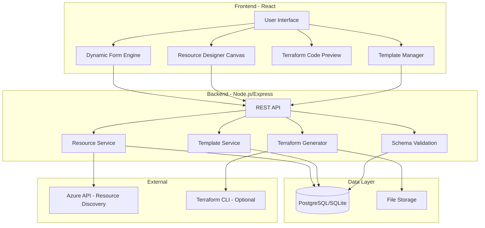
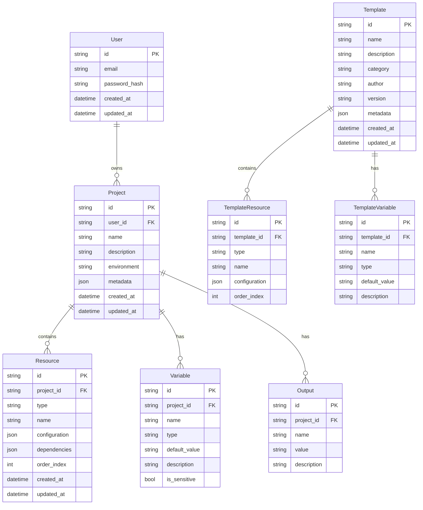
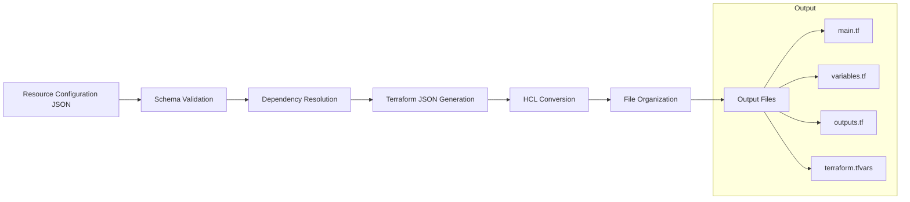

# TerraformUI - Implementation Plan

## Project Overview

**Title:** A GUI-Driven Application for Generating Cloud Infrastructure with Terraform Code Automation for Azure

**Objective:** Create a GUI-driven application that allows users to design and deploy Azure cloud infrastructure resources by selecting properties through an intuitive interface, generating Terraform code without manual coding.

---

## Technology Stack Recommendation

### Frontend
| Component | Technology | Rationale |
|-----------|------------|-----------|
| Framework | **React 18+ with TypeScript** | Strong typing, excellent IDE support, large ecosystem, component reusability |
| UI Library | **Ant Design 5.x** | Enterprise-grade UI components, similar aesthetic to Azure Portal |
| State Management | **Zustand** | Lightweight, TypeScript-friendly, simpler than Redux |
| Form Handling | **React Hook Form + Zod** | Performant forms with schema validation |
| Diagram/Canvas | **React Flow** | Interactive node-based diagrams for resource visualization |
| Code Editor | **Monaco Editor** | VS Code editor component for Terraform preview |
| HTTP Client | **Axios** | Reliable HTTP requests with interceptors |
| Build Tool | **Vite** | Fast development server, optimized builds |

### Backend
| Component | Technology | Rationale |
|-----------|------------|-----------|
| Runtime | **Node.js 20+ LTS** | JavaScript consistency with frontend, excellent async handling |
| Framework | **Express.js** | Mature, well-documented, extensive middleware ecosystem |
| Language | **TypeScript** | Type safety, better developer experience |
| Database | **SQLite (dev) / PostgreSQL (prod)** | Simple local development, scalable production |
| ORM | **Prisma** | Type-safe database access, excellent migrations |
| Validation | **Zod** | Schema validation shared with frontend |
| Terraform Integration | **HashiCorp Terraform JSON** | Programmatic Terraform configuration generation |

### Development Tools
| Tool | Purpose |
|------|---------|
| **ESLint + Prettier** | Code quality and formatting |
| **Jest + React Testing Library** | Unit and integration testing |
| **Playwright** | End-to-end testing |
| **Docker** | Containerization |
| **GitHub Actions** | CI/CD pipeline |

---

## System Architecture



---

## Project Structure

```
terraformUI/
├── frontend/                    # React frontend application
│   ├── src/
│   │   ├── components/          # Reusable UI components
│   │   │   ├── common/          # Generic components - buttons, inputs, modals
│   │   │   ├── forms/           # Dynamic form components
│   │   │   ├── canvas/          # Resource designer canvas
│   │   │   └── code/            # Code preview and editor
│   │   ├── pages/               # Page components
│   │   │   ├── Dashboard/       # Main dashboard
│   │   │   ├── ResourceDesigner/# Resource design page
│   │   │   ├── Templates/       # Template management
│   │   │   └── Settings/        # Application settings
│   │   ├── stores/              # Zustand state stores
│   │   ├── services/            # API service functions
│   │   ├── hooks/               # Custom React hooks
│   │   ├── utils/               # Utility functions
│   │   ├── types/               # TypeScript type definitions
│   │   └── schemas/             # Zod validation schemas
│   ├── public/
│   ├── tests/
│   ├── package.json
│   └── vite.config.ts
│
├── backend/                     # Node.js backend application
│   ├── src/
│   │   ├── controllers/         # Request handlers
│   │   ├── services/            # Business logic
│   │   │   ├── generator/       # Terraform code generation
│   │   │   ├── resources/       # Azure resource definitions
│   │   │   └── templates/       # Template management
│   │   ├── models/              # Prisma models
│   │   ├── routes/              # API route definitions
│   │   ├── middleware/          # Express middleware
│   │   ├── utils/               # Utility functions
│   │   ├── types/               # TypeScript types
│   │   └── schemas/             # Zod validation schemas
│   ├── prisma/
│   │   └── schema.prisma        # Database schema
│   ├── tests/
│   ├── package.json
│   └── tsconfig.json
│
├── shared/                      # Shared code between frontend and backend
│   ├── types/                   # Shared TypeScript types
│   ├── schemas/                 # Shared Zod schemas
│   └── constants/               # Shared constants
│
├── docs/                        # Documentation
│   ├── api/                     # API documentation
│   ├── architecture/            # Architecture decisions
│   └── user-guide/              # User documentation
│
├── plans/                       # Planning documents
├── docker/                      # Docker configuration
├── docker-compose.yml
└── README.md
```

---

## Core Features

### Phase 1 - MVP Features

1. **Resource Selection Interface**
   - Browse available Azure resource types
   - Search and filter resources
   - Resource categorization - Compute, Storage, Networking, etc.

2. **Dynamic Configuration Forms**
   - Auto-generated forms based on resource schema
   - Input validation with helpful error messages
   - Required vs optional field distinction
   - Default value suggestions

3. **Terraform Code Generation**
   - Generate valid Terraform HCL
   - Proper resource naming and references
   - Variable extraction for reusability
   - Output definitions

4. **Code Preview & Export**
   - Real-time code preview
   - Syntax highlighting
   - Copy to clipboard
   - Download as ZIP

### Phase 2 - Enhanced Features

5. **Visual Resource Designer**
   - Drag-and-drop resource canvas
   - Visual connection of resources
   - Dependency visualization
   - Architecture diagram export

6. **Template Management**
   - Save configurations as templates
   - Template library with common patterns
   - Import/export templates
   - Template versioning

7. **Multi-Resource Projects**
   - Manage multiple resources in one project
   - Resource dependencies
   - Project-level variables
   - Environment-specific configurations

### Phase 3 - Advanced Features

8. **Terraform Integration**
   - Terraform validate integration
   - Terraform plan preview
   - Cost estimation integration

9. **Azure Integration**
   - Azure authentication
   - Import existing resources
   - Resource discovery from subscription

10. **Collaboration Features**
    - User authentication
    - Project sharing
    - Team workspaces

---

## Azure Resource Schema Design

Each Azure resource will have a JSON schema definition that drives the UI generation:

```typescript
// Example: Virtual Machine Resource Schema
interface AzureResourceSchema {
  type: string;                    // azurerm_virtual_machine
  displayName: string;             // Virtual Machine
  category: ResourceCategory;      // Compute
  icon: string;                    // Icon identifier
  version: string;                 // Schema version
  properties: PropertyDefinition[];
  required: string[];              // Required property names
  outputs: OutputDefinition[];
  dependencies?: DependencyDefinition[];
}

interface PropertyDefinition {
  name: string;
  displayName: string;
  type: PropertyType;              // string, number, boolean, object, array
  description?: string;
  defaultValue?: any;
  validation?: ValidationRule[];
  enum?: string[];                 // For dropdown selections
  conditional?: ConditionalRule;   // Show/hide based on other properties
  reference?: ReferenceDefinition; // Reference to another resource
}
```

### Initial Resource Support - MVP

| Category | Resources |
|----------|-----------|
| **Compute** | Virtual Machine, Virtual Machine Scale Set, Availability Set |
| **Storage** | Storage Account, Blob Container, File Share |
| **Networking** | Virtual Network, Subnet, Network Security Group, Public IP, Network Interface |
| **Database** | Azure SQL Server, SQL Database, PostgreSQL Server |
| **Container** | Container Registry, Kubernetes Service |

---

## Database Schema



---

## API Specification Overview

### Resources API

| Method | Endpoint | Description |
|--------|----------|-------------|
| GET | `/api/resources/types` | List all available resource types |
| GET | `/api/resources/types/:type/schema` | Get schema for a resource type |
| POST | `/api/resources/validate` | Validate resource configuration |
| POST | `/api/resources/generate` | Generate Terraform for resource |

### Projects API

| Method | Endpoint | Description |
|--------|----------|-------------|
| GET | `/api/projects` | List user projects |
| POST | `/api/projects` | Create new project |
| GET | `/api/projects/:id` | Get project details |
| PUT | `/api/projects/:id` | Update project |
| DELETE | `/api/projects/:id` | Delete project |
| POST | `/api/projects/:id/generate` | Generate all Terraform files |
| GET | `/api/projects/:id/export` | Export project as ZIP |

### Templates API

| Method | Endpoint | Description |
|--------|----------|-------------|
| GET | `/api/templates` | List templates |
| GET | `/api/templates/:id` | Get template details |
| POST | `/api/templates` | Create template from project |
| PUT | `/api/templates/:id` | Update template |
| DELETE | `/api/templates/:id` | Delete template |
| POST | `/api/templates/:id/instantiate` | Create project from template |

---

## Terraform Code Generation Strategy

### Generation Pipeline



### Code Generation Approach

1. **Input**: Validated resource configuration from frontend
2. **Processing**: 
   - Map UI properties to Terraform resource arguments
   - Resolve resource dependencies and references
   - Generate variable definitions for configurable values
3. **Output**: Structured Terraform files following best practices

### Example Output Structure

```hcl
# main.tf
terraform {
  required_version = ">= 1.0.0"
  required_providers {
    azurerm = {
      source  = "hashicorp/azurerm"
      version = "~> 3.0"
    }
  }
}

provider "azurerm" {
  features {}
}

resource "azurerm_resource_group" "main" {
  name     = var.resource_group_name
  location = var.location
}

resource "azurerm_virtual_network" "main" {
  name                = var.vnet_name
  location            = azurerm_resource_group.main.location
  resource_group_name = azurerm_resource_group.main.name
  address_space       = var.vnet_address_space
}
```

```hcl
# variables.tf
variable "resource_group_name" {
  type        = string
  description = "Name of the resource group"
}

variable "location" {
  type        = string
  default     = "eastus"
  description = "Azure region for resources"
}

variable "vnet_name" {
  type        = string
  description = "Name of the virtual network"
}

variable "vnet_address_space" {
  type        = list(string)
  description = "Address space for the virtual network"
}
```

---

## Development Phases

### Phase 1: Foundation - Weeks 1-4

- [ ] Project setup and configuration
  - Initialize monorepo structure
  - Configure TypeScript, ESLint, Prettier
  - Set up development environment
- [ ] Backend core
  - Express server setup
  - Prisma database configuration
  - Basic API structure
- [ ] Frontend core
  - React application setup with Vite
  - Ant Design integration
  - Basic routing and layout
- [ ] First resource implementation
  - Resource Group schema
  - Basic form generation
  - Simple Terraform output

### Phase 2: Core Features - Weeks 5-8

- [ ] Dynamic form engine
  - Schema-driven form generation
  - Validation integration
  - Conditional field logic
- [ ] Resource schema definitions
  - Virtual Machine
  - Storage Account
  - Virtual Network and Subnet
  - Network Security Group
- [ ] Terraform generator
  - JSON to HCL conversion
  - Variable extraction
  - File organization
- [ ] Code preview and export
  - Monaco editor integration
  - Syntax highlighting
  - Download functionality

### Phase 3: Enhanced UX - Weeks 9-12

- [ ] Visual resource designer
  - React Flow canvas
  - Drag-and-drop resources
  - Connection management
- [ ] Template system
  - Template creation
  - Template library
  - Template instantiation
- [ ] Project management
  - Multi-resource projects
  - Dependency management
  - Project persistence

### Phase 4: Polish and Advanced Features - Weeks 13-16

- [ ] Testing
  - Unit tests
  - Integration tests
  - E2E tests
- [ ] Documentation
  - API documentation
  - User guide
  - Developer documentation
- [ ] Advanced features
  - Terraform validate integration
  - Import existing configurations
  - Additional resource types

---

## Success Metrics

| Metric | Target | Measurement Method |
|--------|--------|-------------------|
| **Usability** | User can create basic infrastructure in < 5 minutes | User testing sessions |
| **Accuracy** | Generated Terraform passes validation 100% | Automated testing |
| **Adoption** | Support for 20+ Azure resource types | Resource count |
| **Performance** | Code generation < 2 seconds | Performance monitoring |
| **Satisfaction** | User satisfaction score > 4.0/5.0 | User feedback surveys |

---

## Risk Assessment

| Risk | Impact | Probability | Mitigation |
|------|--------|-------------|------------|
| Azure API changes | High | Medium | Version API integrations, regular updates |
| Terraform schema complexity | High | High | Start with common resources, expand gradually |
| Performance with large configurations | Medium | Medium | Implement pagination, lazy loading |
| User adoption barriers | High | Low | Intuitive UI, comprehensive documentation |

---

## Next Steps

1. **Immediate**: Set up project structure and development environment
2. **Short-term**: Implement first resource schema and basic code generation
3. **Medium-term**: Complete MVP with 5 core resource types
4. **Long-term**: Expand resource library and add advanced features

---

*Document Version: 1.0*
*Last Updated: 2026-02-21*
*Status: Initial Planning Complete*
