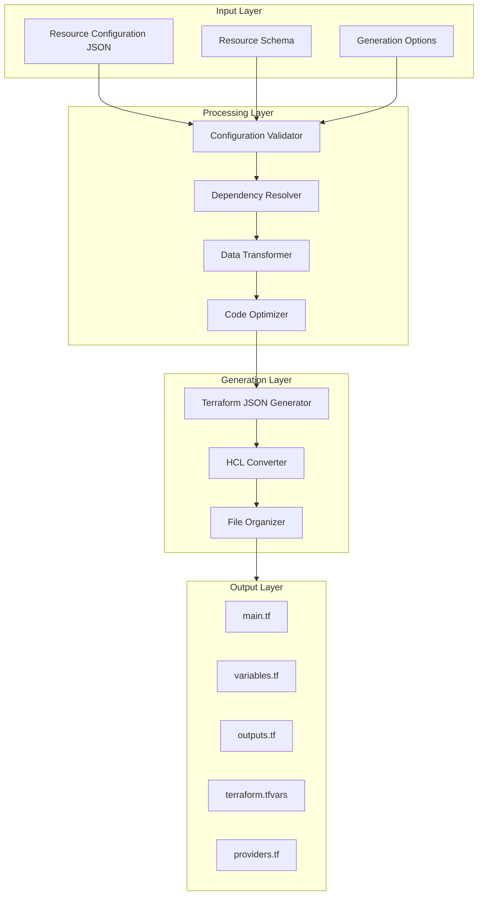

# TerraformUI - Terraform Code Generation Strategy

## Overview

This document outlines the strategy for generating Terraform code from user configurations. The generation process transforms structured JSON configurations into valid, well-organized Terraform HCL files.

---

## Generation Architecture



---

## Core Components

### 1. Configuration Validator

Validates the input configuration against the resource schema.

```typescript
// backend/src/services/generator/validator.ts

interface ValidationResult {
  valid: boolean;
  errors: ValidationError[];
  warnings: ValidationWarning[];
}

interface ValidationError {
  property: string;
  message: string;
  code: string;
}

class ConfigurationValidator {
  constructor(private schemaRegistry: SchemaRegistry) {}
  
  validate(type: string, config: Record<string, any>): ValidationResult {
    const schema = this.schemaRegistry.getSchema(type);
    const errors: ValidationError[] = [];
    const warnings: ValidationWarning[] = [];
    
    // Check required properties
    for (const requiredProp of schema.required) {
      if (!(requiredProp in config) || config[requiredProp] === undefined) {
        errors.push({
          property: requiredProp,
          message: `Missing required property: ${requiredProp}`,
          code: 'REQUIRED'
        });
      }
    }
    
    // Validate each property
    for (const [key, value] of Object.entries(config)) {
      const propDef = schema.properties.find(p => p.name === key);
      if (!propDef) {
        warnings.push({
          property: key,
          message: `Unknown property: ${key}`,
          code: 'UNKNOWN_PROPERTY'
        });
        continue;
      }
      
      const propErrors = this.validateProperty(key, value, propDef);
      errors.push(...propErrors);
    }
    
    return {
      valid: errors.length === 0,
      errors,
      warnings
    };
  }
  
  private validateProperty(
    name: string, 
    value: any, 
    propDef: PropertyDefinition
  ): ValidationError[] {
    const errors: ValidationError[] = [];
    
    for (const rule of propDef.validation || []) {
      if (!this.checkValidationRule(value, rule)) {
        errors.push({
          property: name,
          message: rule.message,
          code: rule.type
        });
      }
    }
    
    return errors;
  }
  
  private checkValidationRule(value: any, rule: ValidationRule): boolean {
    switch (rule.type) {
      case 'required':
        return value !== undefined && value !== null && value !== '';
      case 'minLength':
        return String(value).length >= rule.value;
      case 'maxLength':
        return String(value).length <= rule.value;
      case 'pattern':
        return new RegExp(rule.value).test(String(value));
      case 'min':
        return Number(value) >= rule.value;
      case 'max':
        return Number(value) <= rule.value;
      default:
        return true;
    }
  }
}
```

### 2. Dependency Resolver

Resolves dependencies between resources and determines the correct order.

```typescript
// backend/src/services/generator/dependency-resolver.ts

interface ResolvedResource {
  id: string;
  type: string;
  name: string;
  configuration: Record<string, any>;
  dependencies: string[];
  order: number;
}

class DependencyResolver {
  resolve(resources: Resource[]): ResolvedResource[] {
    // Build dependency graph
    const graph = this.buildDependencyGraph(resources);
    
    // Topological sort to determine order
    const sorted = this.topologicalSort(graph);
    
    // Resolve references in configurations
    return sorted.map((resource, index) => ({
      ...resource,
      configuration: this.resolveReferences(resource, resources),
      order: index
    }));
  }
  
  private buildDependencyGraph(resources: Resource[]): Map<string, Set<string>> {
    const graph = new Map<string, Set<string>>();
    
    for (const resource of resources) {
      const deps = new Set<string>();
      
      // Find references in configuration
      for (const value of Object.values(resource.configuration)) {
        if (typeof value === 'string') {
          const matches = value.match(/\$\{([^}]+)\}/g);
          if (matches) {
            for (const match of matches) {
              const refId = this.extractResourceId(match);
              if (refId) deps.add(refId);
            }
          }
        }
      }
      
      graph.set(resource.id, deps);
    }
    
    return graph;
  }
  
  private topologicalSort(graph: Map<string, Set<string>>): Resource[] {
    const visited = new Set<string>();
    const result: Resource[] = [];
    
    const visit = (id: string) => {
      if (visited.has(id)) return;
      visited.add(id);
      
      const deps = graph.get(id) || new Set();
      for (const dep of deps) {
        visit(dep);
      }
      
      result.push(this.getResource(id));
    };
    
    for (const id of graph.keys()) {
      visit(id);
    }
    
    return result;
  }
  
  private resolveReferences(
    resource: Resource, 
    allResources: Resource[]
  ): Record<string, any> {
    const resolved = { ...resource.configuration };
    
    for (const [key, value] of Object.entries(resolved)) {
      if (typeof value === 'string' && value.startsWith('${')) {
        resolved[key] = this.convertToTerraformRef(value, allResources);
      }
    }
    
    return resolved;
  }
}
```

### 3. Terraform JSON Generator

Generates Terraform JSON configuration (intermediate format).

```typescript
// backend/src/services/generator/json-generator.ts

interface TerraformJSON {
  terraform: TerraformBlock;
  provider: Record<string, any>;
  resource: Record<string, Record<string, any>>;
  variable?: Record<string, VariableBlock>;
  output?: Record<string, OutputBlock>;
}

class TerraformJSONGenerator {
  generate(
    resources: ResolvedResource[],
    variables: Variable[],
    outputs: Output[],
    options: GenerationOptions
  ): TerraformJSON {
    const result: TerraformJSON = {
      terraform: this.generateTerraformBlock(options),
      provider: {},
      resource: {},
      variable: {},
      output: {}
    };
    
    // Add provider configuration
    result.provider.azurerm = this.generateProviderConfig(options);
    
    // Generate resources
    for (const resource of resources) {
      const resourceBlock = this.generateResourceBlock(resource, variables);
      
      if (!result.resource[resource.type]) {
        result.resource[resource.type] = {};
      }
      
      result.resource[resource.type][resource.name] = resourceBlock;
    }
    
    // Generate variables
    for (const variable of variables) {
      result.variable[variable.name] = this.generateVariableBlock(variable);
    }
    
    // Generate outputs
    for (const output of outputs) {
      result.output[output.name] = this.generateOutputBlock(output);
    }
    
    return result;
  }
  
  private generateTerraformBlock(options: GenerationOptions): TerraformBlock {
    return {
      required_version: options.terraformVersion || '>= 1.0.0',
      required_providers: {
        azurerm: {
          source: 'hashicorp/azurerm',
          version: options.providerVersion || '~> 3.0'
        }
      }
    };
  }
  
  private generateProviderConfig(options: GenerationOptions): any {
    const config: any = {
      features: {}
    };
    
    if (options.subscriptionId) {
      config.subscription_id = options.subscriptionId;
    }
    
    if (options.clientId && options.clientSecret) {
      config.client_id = options.clientId;
      config.client_secret = options.clientSecret;
      config.tenant_id = options.tenantId;
    }
    
    return config;
  }
  
  private generateResourceBlock(
    resource: ResolvedResource,
    variables: Variable[]
  ): Record<string, any> {
    const block: Record<string, any> = {};
    
    for (const [key, value] of Object.entries(resource.configuration)) {
      // Check if value should be a variable reference
      const variable = variables.find(v => v.mappedProperty === `${resource.id}.${key}`);
      
      if (variable) {
        block[key] = { var: variable.name };
      } else {
        block[key] = value;
      }
    }
    
    return block;
  }
  
  private generateVariableBlock(variable: Variable): VariableBlock {
    return {
      type: variable.type,
      description: variable.description,
      default: variable.defaultValue,
      sensitive: variable.isSensitive
    };
  }
  
  private generateOutputBlock(output: Output): OutputBlock {
    return {
      value: output.value,
      description: output.description
    };
  }
}
```

### 4. HCL Converter

Converts Terraform JSON to HCL format.

```typescript
// backend/src/services/generator/hcl-converter.ts

class HCLConverter {
  convert(json: TerraformJSON): Record<string, string> {
    const files: Record<string, string> = {};
    
    // Generate main.tf
    files['main.tf'] = this.generateMainTF(json);
    
    // Generate variables.tf
    if (Object.keys(json.variable || {}).length > 0) {
      files['variables.tf'] = this.generateVariablesTF(json);
    }
    
    // Generate outputs.tf
    if (Object.keys(json.output || {}).length > 0) {
      files['outputs.tf'] = this.generateOutputsTF(json);
    }
    
    // Generate terraform.tfvars
    if (Object.keys(json.variable || {}).length > 0) {
      files['terraform.tfvars'] = this.generateTfvars(json);
    }
    
    // Generate providers.tf (optional, separate from main)
    files['providers.tf'] = this.generateProvidersTF(json);
    
    return files;
  }
  
  private generateMainTF(json: TerraformJSON): string {
    const lines: string[] = [];
    
    // Add header comment
    lines.push('# Generated by TerraformUI');
    lines.push(`# Generated at: ${new Date().toISOString()}`);
    lines.push('');
    
    // Add terraform block
    lines.push(this.formatTerraformBlock(json.terraform));
    lines.push('');
    
    // Add resources
    for (const [type, resources] of Object.entries(json.resource)) {
      for (const [name, config] of Object.entries(resources)) {
        lines.push(this.formatResource(type, name, config));
        lines.push('');
      }
    }
    
    return lines.join('\n');
  }
  
  private formatResource(type: string, name: string, config: any): string {
    const lines: string[] = [];
    
    lines.push(`resource "${type}" "${name}" {`);
    lines.push(this.formatBlockContent(config, 1));
    lines.push('}');
    
    return lines.join('\n');
  }
  
  private formatBlockContent(obj: any, indent: number): string {
    const lines: string[] = [];
    const indentStr = '  '.repeat(indent);
    
    for (const [key, value] of Object.entries(obj)) {
      if (value === null || value === undefined) continue;
      
      if (Array.isArray(value)) {
        lines.push(`${indentStr}${key} = ${this.formatValue(value)}`);
      } else if (typeof value === 'object' && !value.var) {
        // Nested block
        lines.push(`${indentStr}${key} {`);
        lines.push(this.formatBlockContent(value, indent + 1));
        lines.push(`${indentStr}}`);
      } else {
        lines.push(`${indentStr}${key} = ${this.formatValue(value)}`);
      }
    }
    
    return lines.join('\n');
  }
  
  private formatValue(value: any): string {
    if (typeof value === 'string') {
      // Check if it's a reference or expression
      if (value.startsWith('${') && value.endsWith('}')) {
        return value.slice(2, -1); // Remove ${ and }
      }
      // Check if it's a variable reference object
      if (value.var) {
        return `var.${value.var}`;
      }
      // Escape and quote string
      return `"${value.replace(/"/g, '\\"')}"`;
    }
    
    if (typeof value === 'boolean') {
      return value ? 'true' : 'false';
    }
    
    if (typeof value === 'number') {
      return String(value);
    }
    
    if (Array.isArray(value)) {
      const items = value.map(v => this.formatValue(v));
      return `[${items.join(', ')}]`;
    }
    
    if (typeof value === 'object') {
      if (value.var) {
        return `var.${value.var}`;
      }
      const entries = Object.entries(value).map(
        ([k, v]) => `${k} = ${this.formatValue(v)}`
      );
      return `{\n${entries.join('\n')}\n}`;
    }
    
    return String(value);
  }
  
  private generateVariablesTF(json: TerraformJSON): string {
    const lines: string[] = [];
    
    lines.push('# Variable definitions');
    lines.push('');
    
    for (const [name, config] of Object.entries(json.variable || {})) {
      lines.push(`variable "${name}" {`);
      lines.push(`  type        = ${config.type}`);
      if (config.description) {
        lines.push(`  description = "${config.description}"`);
      }
      if (config.default !== undefined) {
        lines.push(`  default     = ${this.formatValue(config.default)}`);
      }
      if (config.sensitive) {
        lines.push(`  sensitive   = true`);
      }
      lines.push('}');
      lines.push('');
    }
    
    return lines.join('\n');
  }
  
  private generateOutputsTF(json: TerraformJSON): string {
    const lines: string[] = [];
    
    lines.push('# Output definitions');
    lines.push('');
    
    for (const [name, config] of Object.entries(json.output || {})) {
      lines.push(`output "${name}" {`);
      lines.push(`  value       = ${config.value}`);
      if (config.description) {
        lines.push(`  description = "${config.description}"`);
      }
      lines.push('}');
      lines.push('');
    }
    
    return lines.join('\n');
  }
  
  private generateTfvars(json: TerraformJSON): string {
    const lines: string[] = [];
    
    lines.push('# Variable values');
    lines.push('');
    
    for (const [name, config] of Object.entries(json.variable || {})) {
      if (config.default !== undefined) {
        lines.push(`${name} = ${this.formatValue(config.default)}`);
      }
    }
    
    return lines.join('\n');
  }
  
  private generateProvidersTF(json: TerraformJSON): string {
    const lines: string[] = [];
    
    lines.push('# Provider configuration');
    lines.push('');
    
    for (const [name, config] of Object.entries(json.provider)) {
      lines.push(`provider "${name}" {`);
      lines.push(this.formatBlockContent(config, 1));
      lines.push('}');
      lines.push('');
    }
    
    return lines.join('\n');
  }
  
  private formatTerraformBlock(block: TerraformBlock): string {
    const lines: string[] = [];
    
    lines.push('terraform {');
    lines.push(`  required_version = "${block.required_version}"`);
    lines.push('');
    lines.push('  required_providers {');
    for (const [name, config] of Object.entries(block.required_providers)) {
      lines.push(`    ${name} = {`);
      lines.push(`      source  = "${config.source}"`);
      lines.push(`      version = "${config.version}"`);
      lines.push('    }');
    }
    lines.push('  }');
    lines.push('}');
    
    return lines.join('\n');
  }
}
```

---

## Variable Extraction Strategy

### Automatic Variable Extraction

The system can automatically extract values as variables based on:

1. **User-specified variables**: Values explicitly marked as variables
2. **Common patterns**: Values that typically vary between environments
3. **Sensitive values**: Passwords, keys, secrets

```typescript
// backend/src/services/generator/variable-extractor.ts

interface ExtractionRule {
  propertyPattern: string | RegExp;
  variableName: string;
  description: string;
  isSensitive?: boolean;
}

const DEFAULT_EXTRACTION_RULES: ExtractionRule[] = [
  {
    propertyPattern: 'location',
    variableName: 'location',
    description: 'Azure region for resources',
  },
  {
    propertyPattern: 'admin_password',
    variableName: 'admin_password',
    description: 'Administrator password',
    isSensitive: true,
  },
  {
    propertyPattern: '.*_name$',
    variableName: 'resource_names',
    description: 'Resource naming prefix',
  },
];

class VariableExtractor {
  extract(
    resources: ResolvedResource[],
    rules: ExtractionRule[] = DEFAULT_EXTRACTION_RULES
  ): ExtractedVariable[] {
    const variables: ExtractedVariable[] = [];
    
    for (const resource of resources) {
      for (const [key, value] of Object.entries(resource.configuration)) {
        const matchingRule = rules.find(rule => 
          typeof rule.propertyPattern === 'string'
            ? key === rule.propertyPattern
            : rule.propertyPattern.test(key)
        );
        
        if (matchingRule && typeof value !== 'object') {
          variables.push({
            name: `${resource.name}_${key}`,
            type: this.inferType(value),
            defaultValue: value,
            description: matchingRule.description,
            isSensitive: matchingRule.isSensitive,
            sourceResource: resource.id,
            sourceProperty: key,
          });
        }
      }
    }
    
    return this.deduplicateVariables(variables);
  }
  
  private inferType(value: any): string {
    if (typeof value === 'string') return 'string';
    if (typeof value === 'number') return 'number';
    if (typeof value === 'boolean') return 'bool';
    if (Array.isArray(value)) return 'list(string)';
    return 'any';
  }
  
  private deduplicateVariables(variables: ExtractedVariable[]): ExtractedVariable[] {
    const seen = new Map<string, ExtractedVariable>();
    
    for (const variable of variables) {
      const key = `${variable.sourceResource}.${variable.sourceProperty}`;
      if (!seen.has(key)) {
        seen.set(key, variable);
      }
    }
    
    return Array.from(seen.values());
  }
}
```

---

## Output File Organization

### File Structure

```
generated/
├── main.tf              # Resource definitions
├── providers.tf         # Provider configuration
├── variables.tf         # Variable declarations
├── outputs.tf           # Output declarations
├── terraform.tfvars     # Variable values
├── backend.tf           # Backend configuration (optional)
└── versions.tf          # Version constraints (alternative location)
```

### File Organization Options

```typescript
interface FileOrganizationOptions {
  // Split resources into separate files by category
  splitByCategory: boolean;
  
  // Include backend configuration
  includeBackend: boolean;
  
  // Backend configuration
  backendConfig?: BackendConfig;
  
  // Separate providers file
  separateProvidersFile: boolean;
  
  // Include README with instructions
  includeReadme: boolean;
}

class FileOrganizer {
  organize(
    files: Record<string, string>,
    options: FileOrganizationOptions
  ): Record<string, string> {
    const organized: Record<string, string> = {};
    
    if (options.splitByCategory) {
      // Split main.tf into category files
      Object.assign(organized, this.splitByCategory(files['main.tf']));
    } else {
      organized['main.tf'] = files['main.tf'];
    }
    
    if (options.separateProvidersFile) {
      organized['providers.tf'] = files['providers.tf'];
    }
    
    if (options.includeBackend && options.backendConfig) {
      organized['backend.tf'] = this.generateBackendConfig(options.backendConfig);
    }
    
    if (options.includeReadme) {
      organized['README.md'] = this.generateReadme(files);
    }
    
    // Always include these
    organized['variables.tf'] = files['variables.tf'];
    organized['outputs.tf'] = files['outputs.tf'];
    organized['terraform.tfvars'] = files['terraform.tfvars'];
    
    return organized;
  }
  
  private splitByCategory(mainTf: string): Record<string, string> {
    const categoryMap: Record<string, string[]> = {
      'compute.tf': [],
      'networking.tf': [],
      'storage.tf': [],
      'database.tf': [],
      'security.tf': [],
    };
    
    // Parse and categorize resources
    const resources = this.parseResources(mainTf);
    
    for (const resource of resources) {
      const category = this.getResourceCategory(resource.type);
      const filename = `${category}.tf`;
      
      if (categoryMap[filename]) {
        categoryMap[filename].push(resource.content);
      }
    }
    
    const result: Record<string, string> = {};
    for (const [filename, contents] of Object.entries(categoryMap)) {
      if (contents.length > 0) {
        result[filename] = contents.join('\n\n');
      }
    }
    
    return result;
  }
  
  private generateReadme(files: Record<string, string>): string {
    return `# Terraform Configuration

Generated by TerraformUI

## Files

- \`main.tf\` - Main resource definitions
- \`providers.tf\` - Provider configuration
- \`variables.tf\` - Variable declarations
- \`outputs.tf\` - Output declarations
- \`terraform.tfvars\` - Variable values

## Usage

1. Initialize Terraform:
   \`\`\`bash
   terraform init
   \`\`\`

2. Review the plan:
   \`\`\`bash
   terraform plan
   \`\`\`

3. Apply the configuration:
   \`\`\`bash
   terraform apply
   \`\`\`

## Variables

See \`variables.tf\` for all available variables.

## Outputs

See \`outputs.tf\` for all outputs.
`;
  }
}
```

---

## Generation Pipeline

### Complete Generation Flow

```typescript
// backend/src/services/generator/generator.ts

interface GenerationOptions {
  terraformVersion?: string;
  providerVersion?: string;
  extractVariables: boolean;
  splitByCategory: boolean;
  includeProvider: boolean;
  includeBackend: boolean;
  backendConfig?: BackendConfig;
  includeReadme: boolean;
}

interface GenerationResult {
  files: Record<string, string>;
  variables: Variable[];
  outputs: Output[];
  resourceCount: number;
  warnings: string[];
}

class TerraformGenerator {
  constructor(
    private validator: ConfigurationValidator,
    private dependencyResolver: DependencyResolver,
    private variableExtractor: VariableExtractor,
    private jsonGenerator: TerraformJSONGenerator,
    private hclConverter: HCLConverter,
    private fileOrganizer: FileOrganizer
  ) {}
  
  async generate(
    resources: Resource[],
    options: GenerationOptions
  ): Promise<GenerationResult> {
    const warnings: string[] = [];
    
    // Step 1: Validate all configurations
    for (const resource of resources) {
      const result = this.validator.validate(resource.type, resource.configuration);
      if (!result.valid) {
        throw new GenerationError(
          `Invalid configuration for ${resource.name}: ${result.errors.map(e => e.message).join(', ')}`
        );
      }
      warnings.push(...result.warnings.map(w => w.message));
    }
    
    // Step 2: Resolve dependencies
    const resolvedResources = this.dependencyResolver.resolve(resources);
    
    // Step 3: Extract variables
    let variables: Variable[] = [];
    if (options.extractVariables) {
      variables = this.variableExtractor.extract(resolvedResources);
    }
    
    // Step 4: Generate outputs
    const outputs = this.generateOutputs(resolvedResources);
    
    // Step 5: Generate Terraform JSON
    const terraformJSON = this.jsonGenerator.generate(
      resolvedResources,
      variables,
      outputs,
      options
    );
    
    // Step 6: Convert to HCL
    const hclFiles = this.hclConverter.convert(terraformJSON);
    
    // Step 7: Organize files
    const finalFiles = this.fileOrganizer.organize(hclFiles, {
      splitByCategory: options.splitByCategory,
      includeBackend: options.includeBackend,
      backendConfig: options.backendConfig,
      separateProvidersFile: true,
      includeReadme: options.includeReadme,
    });
    
    return {
      files: finalFiles,
      variables,
      outputs,
      resourceCount: resources.length,
      warnings,
    };
  }
  
  private generateOutputs(resources: ResolvedResource[]): Output[] {
    const outputs: Output[] = [];
    
    for (const resource of resources) {
      const schema = this.schemaRegistry.getSchema(resource.type);
      
      for (const outputDef of schema.outputs) {
        outputs.push({
          name: `${resource.name}_${outputDef.name}`,
          value: outputDef.value.replace('main', resource.name),
          description: outputDef.description,
        });
      }
    }
    
    return outputs;
  }
}
```

---

## Example Output

### Input Configuration

```json
{
  "resources": [
    {
      "id": "rg_001",
      "type": "azurerm_resource_group",
      "name": "main",
      "configuration": {
        "name": "my-resource-group",
        "location": "eastus"
      }
    },
    {
      "id": "vnet_001",
      "type": "azurerm_virtual_network",
      "name": "main",
      "configuration": {
        "name": "my-vnet",
        "resource_group_name": "${azurerm_resource_group.main.name}",
        "location": "eastus",
        "address_space": ["10.0.0.0/16"]
      },
      "dependencies": ["rg_001"]
    }
  ]
}
```

### Generated main.tf

```hcl
# Generated by TerraformUI
# Generated at: 2026-02-21T10:00:00.000Z

terraform {
  required_version = ">= 1.0.0"

  required_providers {
    azurerm = {
      source  = "hashicorp/azurerm"
      version = "~> 3.0"
    }
  }
}

resource "azurerm_resource_group" "main" {
  name     = var.resource_group_name
  location = var.location
}

resource "azurerm_virtual_network" "main" {
  name                = var.vnet_name
  resource_group_name = azurerm_resource_group.main.name
  location            = var.location
  address_space       = var.vnet_address_space
}
```

### Generated variables.tf

```hcl
# Variable definitions

variable "resource_group_name" {
  type        = string
  description = "Name of the resource group"
  default     = "my-resource-group"
}

variable "location" {
  type        = string
  description = "Azure region for resources"
  default     = "eastus"
}

variable "vnet_name" {
  type        = string
  description = "Name of the virtual network"
  default     = "my-vnet"
}

variable "vnet_address_space" {
  type        = list(string)
  description = "Address space for the virtual network"
  default     = ["10.0.0.0/16"]
}
```

### Generated outputs.tf

```hcl
# Output definitions

output "resource_group_id" {
  value       = azurerm_resource_group.main.id
  description = "The ID of the resource group"
}

output "vnet_id" {
  value       = azurerm_virtual_network.main.id
  description = "The ID of the virtual network"
}
```

---

## Best Practices

### Code Quality

1. **Consistent formatting**: Use consistent indentation and spacing
2. **Meaningful names**: Generate descriptive resource and variable names
3. **Comments**: Include helpful comments explaining generated code
4. **Organization**: Group related resources together

### Security

1. **Sensitive variables**: Mark sensitive values appropriately
2. **No hardcoded secrets**: Always extract secrets as variables
3. **Least privilege**: Generate minimal permission configurations

### Maintainability

1. **Modular structure**: Organize code for easy modification
2. **Variable extraction**: Make configurations reusable
3. **Documentation**: Include README with usage instructions

---

*Document Version: 1.0*
*Last Updated: 2026-02-21*
